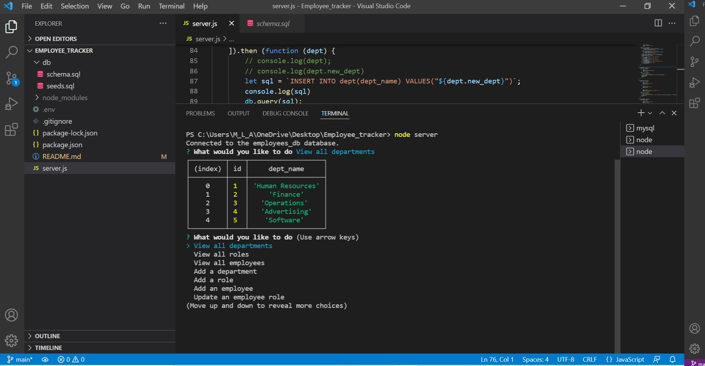

# Employee Tracker

## Video Walkthrough
https://youtu.be/wH3vdVmGd40

## Summary
Employee Tracker utilising Node and MySQL. 

## Description 
A program for creating and maintaining an employee database.

Seed sql file to set initial 'employees' database with tables for department, roles, and employees.  

Node connection to sql to initiate editing capabilities; Options as follows: 

1) View all departments
2) View all roles
3) View all employees
4) Add a department
5) Add a role
6) Add an employee
7) Update an employee role

Prompts are initiated with each option, and tables edited as necessary. 

## Instructions

### Pre-requisites
Visual Studio to run code. 
Node.js installed
MySQL Installed

### NPM Installations
NPM install: express, mysql2, console.table, fs, inquirer

### Execution 
From root, run index.js.

Open Node.js via integrated terminal. Run node index. 

Follow prompts to generate profiles. 

An html output will be generated in the root folder. 

## Contact
grimdango@gmail.com

## Log 
### 15/02/22

### 12/02/22

### 11/02/22

   

